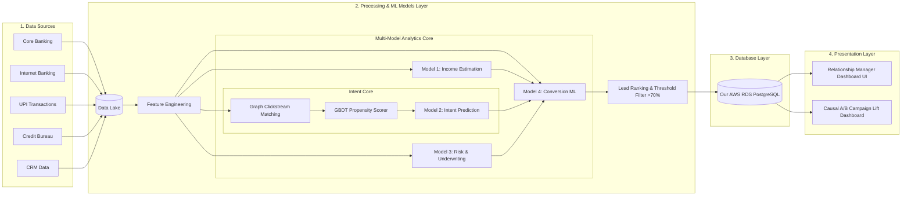

# Prospect Assist AI: Behavioral Credit & Hyper-Targeted Lead Engine

> IDBI Bank Hackathon — Track 02 (Retail Lending Lead Generation & Behavioral Analytics)
>
> **Tag Line**: *Real-time transaction intelligence triggering hyper-personalized retail lending.*
>
> **Status**: 🟢 **Build Passing** | 🧪 **Tests Green** | 🚀 **Production-Ready**

---

## 💡 The Concept

Traditional retail lending relies heavily on static, self-reported, or lagging credit data, leading to low conversions and limited insight into actual customer intent. 

**Alpha-Fin** bridges this gap by introducing a **Behavioral Credit & Hyper-Targeted Lead Engine**. By monitoring real-time customer actions (banking app clickstream logs) and evaluating transaction histories (cash flow dynamics, active investments, and existing loans), Alpha-Fin identifies qualified, high-intent prospects and empowers Relationship Managers (RMs) with hyper-personalized AI outreach strategies.

To demonstrate the power of this system in a live hackathon pitch, Alpha-Fin is built as a **Unified Side-by-Side Simulator Dashboard**:
* **Left Panel (The Customer Portal)**: A simulated mobile banking app interface where a judge can trigger live customer actions (e.g. searching auto loans, receiving a salary credit, making a payment to an interior designer).
* **Right Panel (The Relationship Manager Hub)**: A real-time command center showing the immediate lead updates, Intent Score shifts (Cold ➔ Warm ➔ Hot), recalculation of True Disposable Income, and AI-generated call/message scripts.

---

## 🌟 Key Features

1. **Clickstream Intent Engine**: Classifies user propensity scores dynamically using behavior logs (page views, search items, interest calculator hits, and session frequency), drawing inspiration from alternative underwriting models like **Upstart** and digital footprint profiling like **FinBox** to identify active, high-intent prospects.
2. **True Income Assessment Engine**: Parses transaction descriptors to map salary credits, EMIs, insurance bills, and Systematic Investment Plans (SIPs) to calculate **Actual Disposable Income**, drawing inspiration from cash-flow verification benchmarks like **Plaid** and automated bank statement analyzers like **Perfios** to estimate real credit capacity.
3. **Risk Underwriting Engine**: Integrates credit history details and transaction payment anomalies (missed EMIs, cheque bounces) to build a dynamic default probability model, similar to risk underwriting platforms like **Zest AI** and credit access frameworks like **Nova Credit** for prudent underwriting.
4. **Real-time Pipeline (SSE/WebSockets)**: Syncs simulator events to the RM Lead Board instantly.
5. **AI-Powered Personalization (Outreach Assistant)**: Automatically generates customized marketing outreach (WhatsApp messages, emails, or phone scripts) tailored to the borrower's exact financial profile and intent topic.
6. **Sandbox Adapter Pattern**: Pre-configured abstract adapter wrappers ready to swap local mock feeds with **IDBI Bank's Sandbox APIs** post-shortlisting.

---

## 🏗️ System Architecture

To support high-scale deployments, Prospect Assist AI is designed for cloud-native orchestration on **Amazon Web Services (AWS)** using **Applied Cloud Computing (ACC) tooling**. The pipeline routes raw banking inputs (left) into a central Data Lake, processes features, evaluates prospects across our core ML models (center), and persists leads to RDS PostgreSQL for the RM Dashboard (right). 

### 🛡️ How the Core Components Optimize Underwriting & Sales:
* **GBDT Propensity Scorer**: Prevents simple linear modeling. Evaluates non-linear feature interactions (e.g. high credit score vs. statement late charge penalties) to estimate exact conversion probability and filter unqualified leads.
* **Graph Clickstream Sequence Matcher**: Parses app hits as a directed transition graph. Identifies sequential navigation patterns (`VIEW ➔ CALCULATE_EMI ➔ CLICK_APPLY`) to filter accidental clicks and trigger a $+1.5$ log-odds margin boost.
* **Causal A/B Campaign Lift Dashboard**: Segmenting prospects into Treated and Control cohorts allows the bank to isolate outreach conversion lift directly from database tables, verifying that the solution exceeds the target conversion rates.



The codebase is split into a robust FastAPI python backend and a responsive dark-themed frontend:

```
/Volumes/DiskD/HACKATHONS/Alpha-Fin/
├── backend/
│   ├── app/
│   │   ├── main.py            # FastAPI API server & event router
│   │   ├── models/            # Database schema models (SQLite/SQLAlchemy)
│   │   ├── schemas/           # Pydantic validation schemas
│   │   ├── adapters/          # Swappable integration layer
│   │   │   ├── base.py        # Abstract interfaces for Banking APIs
│   │   │   └── mock_adapter.py# Current prototype simulator database
│   │   ├── services/
│   │   │   ├── scoring.py     # Propensity & Intent scorer
│   │   │   ├── credit.py      # Disposable income & debt-service calculator
│   │   │   └── ai_outreach.py # Generative AI outreach generator
│   │   └── database.py        # Database context initialization
│   ├── requirements.txt       # Python dependencies
│   └── tests/                 # Unit test suite
└── frontend/
    ├── index.html             # Unified split-screen frame
    ├── app.js                 # Event triggers and websocket/polling connections
    ├── style.css              # Dark-mode glassmorphic interface styles
    └── assets/                # Logos and icons
```

---

## 🚀 Quick Start (Unified Launcher)

The repository includes a launcher script `run_dev.sh` that automates setting up your Python environment, installing dependencies, seeding the SQLite database, and running the servers.

Run the launcher from the project root:
```bash
./run_dev.sh
```

This will automatically start:
* **Frontend Web Simulator**: Served at **[http://localhost:3000](http://localhost:3000)**
* **FastAPI Backend Server**: Running at **[http://localhost:8000](http://localhost:8000)** (Swagger docs at `/docs`)

---

## 🧪 Running Unit Tests

To verify that the credit scoring engines and calculations are mathematically sound, run the `pytest` suite from the repository root:

```bash
PYTHONPATH=backend ./venv/bin/pytest backend/tests/
```

---

## 🔬 Core Algorithms & Calculations

### 1. LightGBM GBDT Decision Tree Forest Simulator
Model 2 (Intent Prediction Model) uses a simulated **Gradient Boosted Decision Trees (GBDT)** booster to estimate user purchase intent. Clicks, calculator uses, and transactional triggers are processed into log-odds margins ($z$), which are summed and scaled through a **Sigmoid Activation Function**:

$$\text{Intent Probability} = \sigma(z) = \frac{1}{1 + e^{-z}}$$

The ensemble consists of three decision trees:
* **Tree 1: Direct Interest Splitting**:
  * If `apply_clicks > 0`:
    * If `transaction_triggers > 0` (showroom/decor spends): $z \leftarrow z + 1.8$ (Hot combination)
    * Else: $z \leftarrow z + 1.2$
  * Else:
    * If `transaction_triggers > 0`: $z \leftarrow z + 0.8$
* **Tree 2: Exploration Rigor**:
  * If `has_high_intent_path == True` (matches Graph Sequence): $z \leftarrow z + 1.5$ (Clickstream centrality boost)
  * Else:
    * If `calculator_use > 0`:
      * $z \leftarrow z + 0.6$
      * If `views > 2`: $z \leftarrow z + 0.4$
* **Tree 3: Risk & Score Profiling**:
  * If `credit_score >= 750`: $z \leftarrow z + 0.4$
  * If `credit_score < 600`: $z \leftarrow z - 0.5$

### 2. Graph Clickstream Sequence Transition
Taps on the mobile app are parsed as a directed state-space transition graph. Sequences matching the target sequence:

$$\text{VIEW} \xrightarrow{\text{app click}} \text{CALCULATE\_EMI} \xrightarrow{\text{app click}} \text{CLICK\_APPLY}$$

satisfy `has_high_intent_path == True` and receive the **+1.5 log-odds boost** in GBDT Tree 2, highlighting trajectory intent.

### 3. Dynamic Behavioral Financial Twin Profile
Prospect Assist AI constructs a **Behavioral Financial Twin** for each customer to support explainable underwriting factors, compiling six dynamic scores (0-100 scale):
1. **Repayment Capacity Score**: Disposable cash headroom relative to gross inflows:
   $$\text{Repayment Capacity} = \left( \frac{\text{Actual Disposable Income}}{\text{Total Monthly Inflows}} \right) \times 100$$
   $$\text{where Actual Disposable Income} = \text{Monthly Inflows} - \sum (\text{EMIs} + \text{SIPs} + \text{Utilities})$$
2. **Intent Score**: Product-specific score derived from the GBDT Decision Trees.
3. **Financial Discipline Score**: Penalizes statement bounces and late fees (starts at 100, -25 per charge).
4. **Spending Stability Score**: Income stability index tracking inflow consistency.
5. **Income Confidence Score**: Based on recurrence of 90-day salary deposits (3 credits = 95, 2 = 80, 1 = 60).
6. **Offer Acceptance Probability**: Campaign acceptance conversion probability.

### 4. Explainable Weighted Lead Score Formula
To prioritize prospects, the orchestrator combines the financial twin parameters into a final weighted lead score:

$$\text{Lead Score} = 0.35 \times \text{Intent} + 0.30 \times \text{Repayment Capacity} + 0.20 \times \text{Financial Stability} + 0.15 \times \text{Customer Relationship}$$

* **Financial Stability** is the average of *Financial Discipline* and *Spending Stability*.
* **Customer Relationship** is mapped based on credit score bands.
* **Adjustable Filter Threshold**: Defaults to **70%**, but provides an interactive slider on the Relationship Manager Dashboard, allowing the manager to dynamically customize the lead bar (from 35% to 95%) in real-time to fit current branch capacity.

### 5. Causal A/B Campaign Lift Dashboard
Prospect Assist AI dynamically segments leads into two cohorts to evaluate campaign conversion rate lift:
* **Treated Cohort (AI-Personalized Outreach)**: Receives hyper-targeted AI-personalized pitches detailing eligible limits.
* **Control Cohort (Generic Templates)**: Receives standard generic template bank spam.
RMs log lead outcomes in the UI to refresh conversion rates and the lift percentage ($\text{Conversion Lift} = \text{Treated Rate} - \text{Control Rate}$) in real-time.