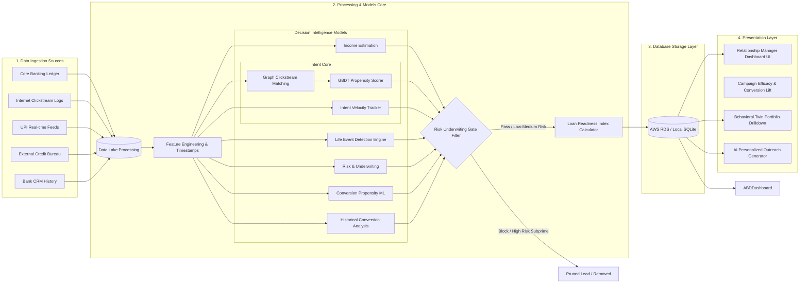
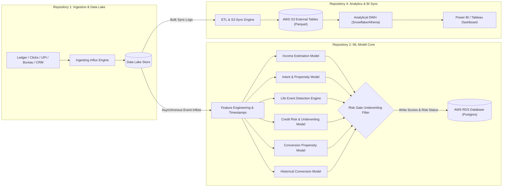
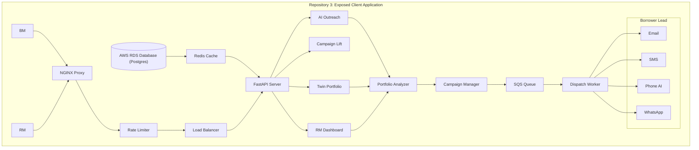

# Prospect Assist AI: Behavioral Credit & Hyper-Targeted Lead Engine

> IDBI Bank Hackathon — Track 02 (Retail Lending Lead Generation & Behavioral Analytics)
>
> **Tag Line**: *Real-time transaction intelligence triggering hyper-personalized retail lending.*
>
> **Live Demo**: 🚀 **[https://chiraghs.github.io/Alpha-Fin/](https://chiraghs.github.io/Alpha-Fin/)** (landing page → launches the Render-hosted app)
>
> **Status**: 🟢 **Build Passing** | 🧪 **Tests Green** | 🚀 **Production-Ready**

---

## 💡 The Concept

Traditional retail lending relies heavily on static, self-reported, or lagging credit data, leading to low conversions and limited insight into actual customer intent. 

**Alpha-Fin** bridges this gap by introducing a **Behavioral Credit & Hyper-Targeted Lead Engine**. By monitoring real-time customer actions (banking app clickstream logs) and evaluating transaction histories (cash flow dynamics, active investments, and existing loans), Alpha-Fin identifies qualified, high-intent prospects and empowers Relationship Managers (RMs) with hyper-personalized AI outreach strategies.

To demonstrate the power of this system in a live hackathon pitch, Alpha-Fin is built as a **Unified Side-by-Side Simulator Dashboard**:
* **Left Panel (The Customer Portal)**: A simulated mobile banking app interface where a judge can trigger live customer actions (e.g. searching auto loans, receiving a salary credit, making a payment to an interior designer).
* **Right Panel (The Relationship Manager Hub)**: A real-time command center showing the immediate lead updates, Intent Score shifts (Cold ➔ Warm ➔ Hot), recalculation of True Disposable Income, and AI-generated call/message scripts.

---

## 🌟 Key Features

1. **Clickstream Intent Engine**: Classifies user propensity scores dynamically using behavior logs (page views, search items, interest calculator hits, and session frequency), drawing inspiration from alternative underwriting models like **Upstart** and digital footprint profiling like **FinBox** to identify active, high-intent prospects.
2. **True Income Assessment Engine**: Parses transaction descriptors to map salary credits, EMIs, insurance bills, and Systematic Investment Plans (SIPs) to calculate **Actual Disposable Income**, drawing inspiration from cash-flow verification benchmarks like **Plaid** and automated bank statement analyzers like **Perfios** to estimate real credit capacity.
3. **Risk Underwriting Engine**: Integrates credit history details and transaction payment anomalies (missed EMIs, cheque bounces) to build a dynamic default probability model, similar to risk underwriting platforms like **Zest AI** and credit access frameworks like **Nova Credit** for prudent underwriting.
4. **Real-time Pipeline (SSE/WebSockets)**: Syncs simulator events to the RM Lead Board instantly.
5. **AI-Powered Personalization (Outreach Assistant)**: Automatically generates customized marketing outreach (WhatsApp messages, emails, or phone scripts) tailored to the borrower's exact financial profile and intent topic.
6. **Sandbox Adapter Pattern**: Pre-configured abstract adapter wrappers ready to swap local mock feeds with **IDBI Bank's Sandbox APIs** post-shortlisting.

---

## 🏗️ System Architecture

To support high-scale deployments, Prospect Assist AI is designed for cloud-native orchestration on **Amazon Web Services (AWS)** using **Applied Cloud Computing (ACC) tooling**. The pipeline routes raw banking inputs (left) into a central Data Lake, processes features, evaluates prospects across our core ML models (center), and persists leads to RDS PostgreSQL for the RM Dashboard (right). 

### 🛡️ How the Core Components Optimize Underwriting & Sales:
* **GBDT Propensity Scorer**: Prevents simple linear modeling. Evaluates non-linear feature interactions (e.g. high credit score vs. statement late charge penalties) to estimate exact conversion probability and filter unqualified leads.
* **Graph Clickstream Sequence Matcher**: Parses app hits as a directed transition graph. Identifies sequential navigation patterns (`VIEW ➔ CALCULATE_EMI ➔ CLICK_APPLY`) to filter accidental clicks and trigger a $+1.5$ log-odds margin boost.
* **Campaign Efficacy & Conversion Lift Dashboard**: Segmenting prospects into Treated and Control cohorts allows the bank to isolate outreach conversion lift directly from database tables, verifying that the solution exceeds the target conversion rates.


## 🌐 Enterprise Distributed Microservices Architecture (Post-Submission Roadmap)

For post-hackathon enterprise scaling, the monolithic prototype will transition into a highly available, decoupled **4-Repository Distributed Architecture** supported by industrial-grade API gateway, caching, queuing, and analytical data warehouse synchronization layers:



### Prospect AI Application (Prospect Assist AI: Behavioral Credit & Hyper-Targeted Lead Engine)



### 🛡️ Core Infrastructure & Resilience Layers:
* **Decoupled Data & Model Pipelines (Repo 1 & Repo 2 Side-by-Side)**:
    * **Repository 1: Ingestion Service & Data Lake Store** and **Repository 2: ML Multi Model Core** function side-by-side to ingest banking inputs, write to the Data Lake, asynchronously trigger scoring models, and persist pre-approved parameters directly to the model database.
    * Decoupling the data lake from execution ensures that heavy machine learning calculations do not block raw transaction logging or clickstream ingestion feeds.
* **Exposed Client Application (Repository 3 - Decoupled Vertical Gateway Pyramid)**:
    * Front-facing RM dashboard interactions flow vertically: **`User (RM)` ➔ `NGINX Proxy` ➔ `Rate Limiter/Idempotency Security Gateway` ➔ `Load Balancer` ➔ `Repository 3 App Server` ➔ `Redis Cache / App DB` ➔ `Client Presentation Views (Dashboard, Lift, Twin, Outreach)`**.
    * Repository 3 is purposefully disconnected at the network level from Repository 1 and Repository 2 to ensure absolute security and isolated client-facing execution.
    * **Asynchronous SQS/Celery Outbox Queues**: Offloads personalized outreach and automated CRM alert dispatches to background Celery workers downstream of the Client UI views.

---

The codebase is split into a robust FastAPI python backend and a responsive dark-themed frontend:

```
/Volumes/DiskD/HACKATHONS/Alpha-Fin/
├── backend/
│   ├── app/
│   │   ├── main.py            # FastAPI API server & event router
│   │   ├── models/            # Database schema models (SQLite/SQLAlchemy)
│   │   ├── schemas/           # Pydantic validation schemas
│   │   ├── adapters/          # Swappable integration layer
│   │   │   ├── base.py        # Abstract interfaces for Banking APIs
│   │   │   └── mock_adapter.py# Current prototype simulator database
│   │   ├── services/
│   │   │   ├── scoring.py     # Propensity & Intent scorer
│   │   │   ├── credit.py      # Disposable income & debt-service calculator
│   │   │   └── ai_outreach.py # Generative AI outreach generator
│   │   └── database.py        # Database context initialization
│   ├── requirements.txt       # Python dependencies
│   └── tests/                 # Unit test suite
└── frontend/
    ├── index.html             # Unified split-screen frame
    ├── app.js                 # Event triggers and websocket/polling connections
    ├── style.css              # Dark-mode glassmorphic interface styles
    └── assets/                # Logos and icons
```

---

## ✨ Next.js Frontend (v2)

A production-grade **Next.js (App Router + TypeScript + Tailwind v4)** rebuild of the frontend lives in [`frontend-next/`](frontend-next/). It adds the official **IDBI Bank brand system** (Orange Passion `#F58220` / Observatory Green `#00836C` + recreated logo mark), **light & dark themes**, a working in-phone EMI calculator, a live pipeline event stream, a Behavioral Twin radar fingerprint, and the same in-browser Standalone Engine fallback — exported fully static for GitHub Pages.

**One command starts everything** (FastAPI backend :8000 + Next.js frontend :3000):

```bash
./start.sh            # local dev — python venv + next dev, Ctrl+C stops both
./start.sh --docker   # containerized — docker compose up --build
```

The launcher prints a LAN URL (e.g. `http://192.168.x.x:3000`) so the fully **mobile-responsive** UI can be opened from a phone on the same Wi-Fi — the app auto-derives the backend address from the page host, so live API data works on mobile too. Ports busy? Override them: `BACKEND_PORT=8010 FRONTEND_PORT=3100 ./start.sh`.

The original vanilla JS prototype remains in `frontend/` (launched by the legacy `run_dev.sh`).

## 🚀 Quick Start (Unified Launcher)

The repository includes a launcher script `run_dev.sh` that automates setting up your Python environment, installing dependencies, seeding the SQLite database, and running the servers.

Run the launcher from the project root:
```bash
./run_dev.sh
```

This will automatically start:
* **Frontend Web Simulator**: Served at **[http://localhost:3000](http://localhost:3000)**
* **FastAPI Backend Server**: Running at **[http://localhost:8000](http://localhost:8000)** (Swagger docs at `/docs`)

---

## 🔬 Deep Dive: Core Algorithms, Models & Decision Intelligence

Prospect Assist AI functions as a complete **AI Decision Intelligence Engine**, shifting the bank's retail lending from static eligibility scoring to dynamic timeline readiness matching.

### 1. Model Data Flow & Ingestion Processing Pipeline
The diagram below shows how transactional raw data lakes are engineered into features, routed through strict Risk underwriter gates, scored via LRI product formulas, and routed to relationship managers:

```
[Core Banking | Internet Banking | UPI Transactions | Credit Bureau | CRM Data]
                                │
                          ───────────────
                             Data Lake
                          ───────────────
                                │
                       Feature Engineering
                                │
        ┌───────────────────────┼───────────────────────┐
        │                       │                       │
  ┌───────────┐         [Graph Sequence]          ┌───────────┐
  │  Model 1: │                 │                 │  Model 3: │
  │   Income  │        [GBDT Propensity]          │   Risk    │
  │ Estimation│                 │                 │Underwritg │
  └─────┬─────┘         ┌───────┴───────┐         └─────┬─────┘
        │               │   Model 2:    │               │
        │               │ Intent Engine │               │
        └───────┬───────┘               └───────┬───────┘
                │                               │
                └───────────────┬───────────────┘
                                │
                         ┌───────────────┐        ┌───────────┐
                         │   Model 4:    │ ◄───── │  Model 5: │
                         │ Conversion ML │        │ Historical│
                         └───────────────┘        └───────────┘
                                 │
                           Lead Ranking 
                     (Filter: Threshold >70%)
                                 │
                   ┌─────────────┴─────────────┐
                   │                           │
          ┌────────┴────────┐         ┌────────┴────────┐
          │   Treated Cohort│         │   Control Cohort│
          └────────┬────────┘         └────────┬────────┘
                   │                           │
         ┌─────────┴───────────────────────────┴─────────┐
         │       Relationship Manager Lead Board         │
         ├───────────────────────────────────────────────┤
         │  [ Leads & Campaign ]  [ Portfolio Analyzer ] │
         └───────────────────────────────────────────────┘
```

---

### 2. Multi-Model ML Pipeline Specification

Instead of a single credit score, Prospect Assist AI coordinates **five specialized ML and cash flow models**:

#### 📈 Model 1: Cash Flow Income Estimation Model
* **Purpose**: Calculates actual disposable cash flows without manual paper statements upload.
* **Math formulation**:
  $$\text{Actual Disposable Income} = \text{Monthly Inflows} - \sum (\text{Existing EMIs} + \text{Active SIPs} + \text{Fixed Utilities})$$
* **Output**: Estimates true disposable capacity to support prudent underwriting.

#### 🎯 Model 2: Intent Prediction Model (GBDT Booster)
* **Purpose**: Evaluates immediate borrowing intent from digital actions.
* **GBDT Forest Ensemble splits**:
  * **Tree 1 (Direct Clicks)**: Splitting on `apply_clicks` and transactional showroom tags (HPCL fuel, showroom spends). Boosts +1.8 for hot combination, +1.2/0.8 for partial hits.
  * **Tree 2 (Exploration Rigor)**: Boosts **+1.5 log-odds** if the sequential app transition pattern matches the target graph sequence:
    $$\text{VIEW} \xrightarrow{\text{app click}} \text{CALCULATE EMI} \xrightarrow{\text{app click}} \text{CLICK APPLY}$$
    Otherwise scales with calculator usage.
  * **Tree 3 (Risk Profiling)**: Shifts log-odds (+0.4 for credit score $\ge 750$, -0.5 for subprime $< 600$).
* **Sigmoid Activation**: Converts raw summed margins ($z$) into a scaled probability:
  $$\text{Intent Score} = \sigma(z) \times 100 = \frac{100}{1 + e^{-z}}$$

#### 🛡️ Model 3: Underwriting Risk Filter Gate
* **Purpose**: Strict gate block filtering subprime default risks.
* **Gate Rules**: If `credit_score < 600` OR `pd_risk >= 0.50` OR `late_charges_count >= 2`, they are marked **High Risk (Subprime)** and are deleted or skipped from active leads.

#### 💸 Model 4: Blended Campaign Conversion Model
* **Purpose**: Predicts probability that a generated lead will accept the outreach campaign.
* **Weighted Blend**: Integrates GBDT intent conversion propensity with historical conversion performance:
  $$P_{\text{conversion}} = 0.70 \times P_{\text{GBDT}} + 0.30 \times P_{\text{history}}$$

#### 📈 Model 5: Historical Conversion Propensity Model
* **Purpose**: Evaluates prior loan repayment behaviors and campaign conversion status flags.
* **Acceptance Rate calculation**:
  $$R_{\text{accept}} = \frac{N_{\text{converted}}}{N_{\text{total\_leads}}}$$
* **Log-Odds Conversion Scoring**:
  $$z_{\text{hist}} = 2.0 \times (R_{\text{accept}} - 0.5) - 0.4 \times N_{\text{missed}} + (0.3 \text{ if } N_{\text{active}} > 0 \text{ and } N_{\text{missed}} = 0 \text{ else } 0)$$

---

### 3. Loan Readiness Index (LRI) Formulation
We prioritizing leads using the multiplicative **Loan Readiness Index (LRI)**. To ensure a single poor dimension doesn't completely zero out the score while maintaining a multiplicative penalty, we use a soft-bounded product:

$$LRI = 100 \times \prod_{i=1}^5 \left( 0.2 + 0.8 \times \frac{\text{Score}_i}{100} \right)$$

*Where the 5 component scores are:*
1. $\text{Score}_1 = \text{Repayment Capacity}$ (Net disposable cash relative to inflows)
2. $\text{Score}_2 = \text{Intent Score}$ (Digital GBDT intent)
3. $\text{Score}_3 = \text{Financial Stability}$ (Average of Discipline and spending consistency)
4. $\text{Score}_4 = \text{Life Event Confidence}$ (Based on detected life triggers, default 50% if none)
5. $\text{Score}_5 = \text{Relationship Strength}$ (Mapped relationship tenure and credit rating)

---

### 4. Dynamic Life Event Detection Engine
We parse transaction narratives and click streams for high-probability life events:
* **💍 Marriage Planning**: Shopping debits containing wedding keywords (`JEWELLER`, `WEDDING`, `MARRIAGE`, `BANQUET`). Confidence: 90% if transaction found, 40% if only digital click stream views.
* **🎓 School Fees**: Debit transactions matching `SCHOOL`, `COLLEGE`, `TUITION`, `ACADEMY`. Confidence: 85%.
* **🚗 Vehicle Upgrade**: Insurance premiums or auto dealer interactions (`MARUTI`, `HYUNDAI`, `MOTORS`, `INSURANCE`). Confidence: 80%.
* **🏠 Rent Deposit / Home Search**: Security deposit transactions (`NOBROKER`, `DEPOSIT`, `RENTAL`) paired with home loan calculator views. Confidence: 90%.
* **📈 Promotion / Inflow Surge**: Detects if the latest salary transaction is $\ge 15\%$ higher than the average of past salaries. Confidence: 95%.

---

### 5. Intent Velocity Tracking
We track the rate of change of clickstream events to identify hot prospects:
$$\text{Velocity} = \text{Intent}_{\text{recent 7 days}} - \text{Intent}_{\text{prior 7-14 days}}$$
If a customer's velocity is $\ge 15\%$ points, they are tagged with a **`⚡ Call Now`** surge status badge on the leads board.

---

### 6. Dynamic Behavioral Financial Twin Profiles
Rather than assigning a simple, opaque credit score, Prospect Assist AI generates a dynamic **Behavioral Financial Twin** for each customer to support explainable underwriting factors, compiling six component scores (0-100 scale):
1. **Repayment Capacity**: Disposable cash headroom relative to gross inflows.
2. **Intent Score**: Product-specific score derived from GBDT decision trees.
3. **Financial Discipline**: Rates historical repayment stability, penalizing account statement bounces and late fees.
4. **Spending Stability**: Monitors monthly cash-flow stability.
5. **Income Confidence**: Measures salary deposit consistency (repetition intervals over a rolling 90-day window).
6. **Offer Acceptance Probability**: Blends digital GBDT conversion propensity with historical conversion rate and missed repayments.

---

### 7. Comprehensive Feature Matrix

Our core models ingest and engineer features across four distinct categories, drawing design patterns from leading global financial tech models:

* **Transaction Behaviour (Inflow/Outflow Verification)**: Similar to cash flow verification platforms like **Plaid** and statement scoring engines like **Perfios**, we analyze monthly salary stability, average balance averages, and subtract fixed commitments (current EMIs, rent, utilities).
* **Behavioural Analytics (Intent & Digital Footprint)**: Similar to digital footprint scoring frameworks like **FinBox**, we capture interest calculators, drop-off actions, and comparators to predict acquisition propensity.
* **Relationship & Underwriting Profiles**: Drawing inspiration from alternative scorecards like **Upstart**, dynamic underwriters like **Zest AI**, and thin-file access networks like **Nova Credit**, we combine external bureau scores with internal historical cheque bounce frequencies and card utilization.

## 📸 Product Demonstration (UI Screenshots)

Here is a visual walk-through of the Prospect Assist AI relationship manager console and its core interactive screens:

### 1. Unified Relationship Manager Hub Dashboard
The command center displays the prioritized lead scoring board, the live customer behavior simulator triggers (left panel), and the dynamic conversion performance lift tracking metrics in real-time.


### 2. Behavioral Financial Twin Radar Analyzer
The customer portfolio sub-screen provides a deep underwriting inspection tool. Select any customer to view their six twin metrics dynamically simulated across various loan types with explainable AI reason narrative logging.


### 3. Hyper-Targeted Outreach Campaign Modal
Clicking on outreach prompts a glassmorphic centered overlay dialog detailing campaign templates for different channels (WhatsApp, Email, RM Scripts) personalized to the specific customer's behavioral history.

