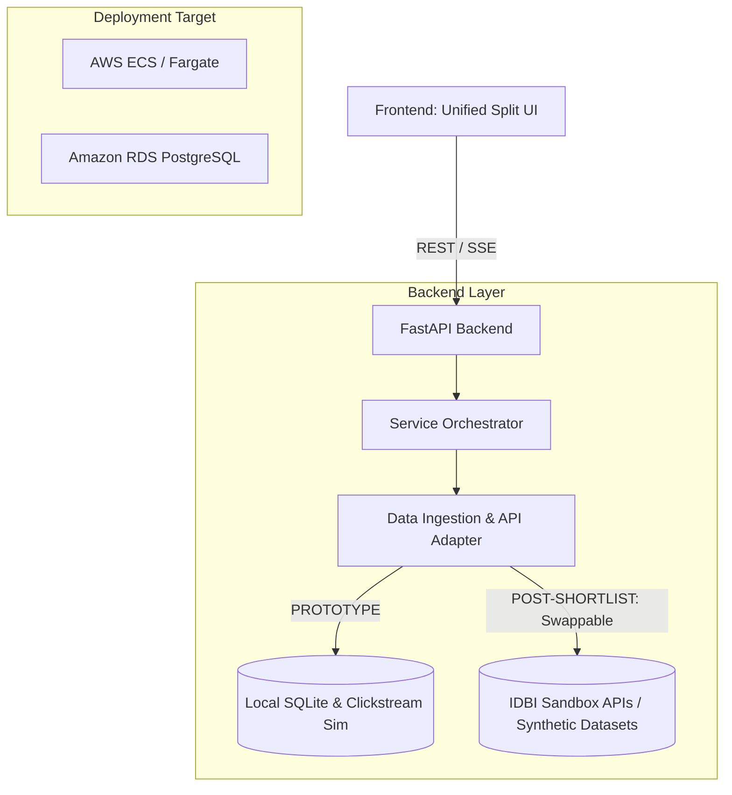

# Implementation Plan: Behavioral Credit & Hyper-Targeted Lead Engine (Track 02)

This plan outlines the architecture, data models, and developmental phases for building the **Behavioral Credit & Hyper-Targeted Lead Engine** (Alpha-Fin) for the **IDBI Innovate 2026 Hackathon**. 

This plan is specifically structured to design a solution that is **production-ready**, **cloud-native**, and **sandbox-adaptable** to seamlessly integrate the IDBI Sandbox APIs, synthetic datasets, and AWS infrastructure provided after shortlisting (scheduled for July 22 - July 31).

---

## 🛠️ Architecture: Local Prototype vs. IDBI Sandbox Target

To ensure a smooth transition once shortlisted, the backend is built using the **Adapter Design Pattern**. This allows us to run on local mock data now and swap to the official IDBI APIs and AWS services with simple configuration changes.



### 1. Swappable Data & API Layer (The Adapter Pattern)
* **Transaction Ingestion**: A dedicated parser in `data_ingestion.py` will read the raw synthetic transaction and UPI log datasets provided by IDBI Bank.
* **API Handshake**: The endpoint wrappers (e.g., retrieving bank statement feeds, mapping credit balances) are routed through abstract classes. Swapping from local mocks to IDBI's Sandbox API only requires changing the active class implementation.

### 2. AWS & ACC Deployment Ready
* **Database**: PostgreSQL-compatible database schemas using SQLAlchemy, ready to migrate from local SQLite to **Amazon RDS (PostgreSQL)**.
* **Hosting**: The FastAPI service container is Dockerized, ready to deploy to **AWS ECS/Fargate** or **AWS Elastic Beanstalk** using Applied Cloud Computing (ACC) tooling.

---

## 🏗️ System Directory Structure

```
/Volumes/DiskD/HACKATHONS/Alpha-Fin/
├── backend/
│   ├── app/
│   │   ├── main.py            # FastAPI entry point & API Router
│   │   ├── models/            # SQLAlchemy models (PostgreSQL compatible)
│   │   ├── schemas/           # Pydantic validation schemas
│   │   ├── adapters/          # Swappable integration layer
│   │   │   ├── base.py        # Abstract interfaces for Banking APIs
│   │   │   ├── mock_adapter.py# Current prototype simulator database
│   │   │   └── idbi_sandbox.py# [Future] IDBI Sandbox API adapter
│   │   ├── services/
│   │   │   ├── scoring.py     # Propensity & Intent calculation
│   │   │   ├── credit.py      # Disposable income & debt-service calculator
│   │   │   └── ai_outreach.py # Generative AI outreach generator
│   │   └── database.py        # SQLAlchemy engine initializer
│   ├── requirements.txt       # Python dependency declarations
│   └── tests/                 # Pytest test suite
└── frontend/
    ├── index.html             # Unified split-screen frame
    ├── app.js                 # Frontend state and event handling
    ├── style.css              # Custom dark-mode glassmorphic styling
    └── assets/                # Mock assets, logos, and animations
```

---

## 🛠️ Phase-by-Phase Development Plan

### 📅 Phase 1: Foundation & Backend Ingestion Services
* **Goal**: Establish DB schemas, implement core scoring engines, and code the API adapters.
* **Key Tasks**:
  * Set up database models with clean abstractions for `Customer`, `Transaction`, `ClickstreamEvent`, and `Lead`.
  * Write the abstract adapter base class for bank statement and event reading.
  * Implement the **Intent Engine** (`scoring.py`):
    * Calculate dynamic `Intent Score` based on clickstream logs (e.g. page views, session duration, auto/home loan calculator usage).
  * Implement the **True Income Assessment Engine** (`credit.py`):
    * Parse transactional logs to identify recurring monthly inflows (salary, dividends) and outflows (existing EMIs, active mutual fund SIPs, fixed utility bills).
    * Calculate `Actual Disposable Income` = `Total Inflows` - `Mandatory Outflows`.

### 📅 Phase 2: Split-Screen Simulator UI (Frontend)
* **Goal**: Build a unified, high-fidelity browser interface representing the live customer journey and the RM control room.
* **Left Panel: Customer Mobile Simulator**:
  * Simulated banking mobile application.
  * Quick-trigger event simulator buttons:
    * *Button A*: "Simulate Salary Hike (15% credit bump)"
    * *Button B*: "Simulate Auto Loan Interest Search (3 clicks)"
    * *Button C*: "Simulate $45,000 transaction to Home Decor/Interior Vendor"
* **Right Panel: Relationship Manager (RM) Hub**:
  * **Lead Board**: Dynamic customer lead lists ranked by Propensity Score and Debt-Service Coverage.
  * **Behavioral Timeline**: Live event logs showing customer actions leading to the trigger.
  * **AI Outreach Assistant**: Generates customized WhatsApp/email pitches tailored to customer context and their exact loan type.

### 📅 Phase 3: AI Integration, Test Suit & AWS Readiness
* **Goal**: Connect the generative AI writing assistant, ensure compliance, run standard linting, and verify.
* **Key Tasks**:
  * Integrate LLM endpoints (via Gemini/OpenAI APIs) to customize RM marketing copy.
  * Implement `backend/tests/` to run unit tests verifying the calculation of disposable income and correct scoring of client intent.
  * Create a Dockerfile to ensure containerized portability for the AWS/ACC cloud hosting.

---

## 🚀 Post-Shortlisting Roadmap (July 22 - July 31)

Once shortlisted for the Sandbox phase, the system will adapt along the following path:

```
[Shortlisting (July 22)] 
   └── 1. Swapping mock adapters with IDBI Sandbox APIs in backend/app/adapters/
   └── 2. Ingesting synthetic UPI & Transaction Datasets into postgres
   └── 3. Setting up cloud deployment on AWS ECS + RDS PostgreSQL
   └── 4. Refining model parameters using official transaction logs
   └── 5. Live Demonstration & Pitch to IDBI Mentors
```

---

## 🔍 Verification Plan

### Automated Tests
* Run `pytest` to verify:
  1. Propensity scores increase correctly when clickstream event logs are added.
  2. Disposable income calculations accurately account for EMI deductions.
  3. Lead priority rankings sort `Hot` leads with high disposable income first.

### Manual Verification
* Run the unified split-screen app in a browser:
  1. Trigger "Auto Loan Search" inside the simulated phone panel.
  2. Verify that the customer instantly appears in the RM Lead Board with a `Warm` tag.
  3. Trigger "Home Decor Spend" and "Salary Hike".
  4. Verify that their propensity upgrades to `Hot`, credit limits recalculate, and the AI outreach generator outputs a pitch mentioning home interior loans.
